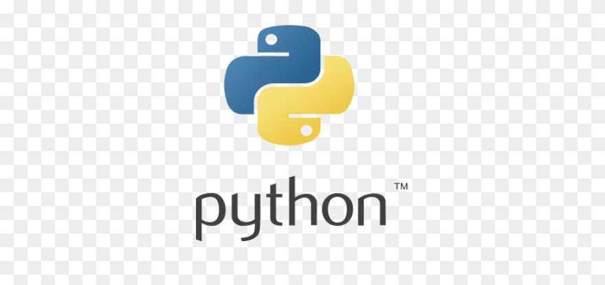

# Proyectos REcientes

### Proyecto 1: Scrapeo con Python
Extracción de información usando técnicas de Scrapy, Selenium y BeautifulSoup, la programación fue fullstack ya que desarrolle: infraestructura de servidores, bases de datos, backend y frontend.

  

### Proyecto 2: [Nombre del Proyecto 2](enlace_al_proyecto2)
Descripción breve del proyecto 2.

  

### Proyecto 3: [Nombre del Proyecto 3](enlace_al_proyecto3)
Descripción breve del proyecto 3.

  

## Habilidades

- HTML5
- CSS3
- JavaScript
- ...

## Contacto

Puedes contactarme a través de <a href="mailto:stevezappstudio@gmail.com" style="color: #007bff; text-decoration: none;">correo electrónico</a>.

